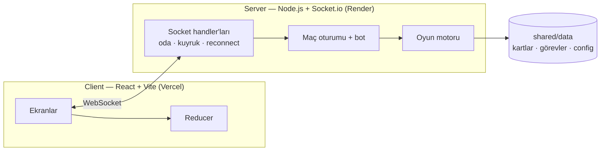

# Futbol Kart Düellosu

İki kişilik, gerçek zamanlı bir futbol kart oyunu. Önce kartlardan kadronu kuruyorsun, sonra rakibinle 5 turluk bir düelloya giriyorsun. Her turda bir görev çıkıyor ve iki taraf da rakibin kartını görmeden, aynı anda kartını oynuyor.

**Canlı:** https://futbol-kart-duellosu-server-virid.vercel.app

[](https://github.com/merenkoc/futbol-kart-duellosu/actions/workflows/test.yml)

<p align="center">
  
  
  
</p>
<p align="center">
  
  
  
</p>

Bu Draft oyunu yayımladığım ilk oyun deneyimim. Sırada bu oyunu mobil platforma taşıma hedefim var. Yakında...

## Oyun nasıl oynanıyor

**Takım seçimi.** 9 milli takım ve 6 lig arasından bir havuz seçiliyor. İki oyuncu da aynı havuzdaki oyunculardan kadro kuruyor.

**Draft.** 5 tur sürüyor. Her turda önüne 3 kart geliyor ve birini alıyorsun; 3. tur kaleci turu. Sonunda elinde 4 saha oyuncusu ve 1 kaleci oluyor. Şans faktörü dengesiz olmasın diye iki oyuncuya her turda aynı kademe dağılımı sunuluyor. Maçta çıkacak görevler draft sırasında görünüyor, kadroyu ona göre kurabiliyorsun.

**Maç.** 5 tur. Her turda bir görev açıklanıyor: ara pası, kontratak, uzaktan şut gibi. İki oyuncu da kör seçimle bir kart oynuyor ve göreve uygun statlar karşılaştırılıyor. Turu kazanan 3, beraberlikte iki taraf da 1 puan alıyor. Oynanan kart bir daha kullanılamıyor.

**Kilit Round.** 3. turda kart seçilmiyor, iki kaleci otomatik olarak karşı karşıya geliyor.

**Penaltılar.** Puanlar eşitse penaltıya gidiliyor. Atıcı gücü rakip kalecinin kurtarış gücünü geçerse gol oluyor. Eşitlik sürerse ani ölüm oynanıyor; saha kartları biterse kaleciler birbirine atıyor.

## Özellikler

- Üç mod var: bota karşı, arkadaşla (oda linkiyle) ve rastgele eşleşme.
- Tüm oyun mantığı sunucuda çalışıyor. Rakibin eli ve henüz açılmamış seçimi client'a hiç gönderilmiyor, yani tarayıcıdan bakıp hile yapılamıyor.
- Bağlantı koparsa 60 saniye içinde maça geri dönülebiliyor. Sayfayı yenilemek de maçı bozmuyor.
- 15 havuzda toplam 450 kart var (375 saha oyuncusu, 75 kaleci).
- Görev formülleri JSON'da tanımlı. Yeni bir görev eklemek için koda dokunmak gerekmiyor.
- Kart çevirme, Kilit Round ve penaltı için animasyonlar var (Framer Motion). Ses efektleri dosya yerine Web Audio ile anlık üretiliyor.
- Mobil tarayıcıda da oynanabiliyor.
- 110 otomatik test var ve her push'ta GitHub Actions'ta çalışıyor.

## Mimari



Proje npm workspaces ile üç pakete bölünmüş:

- `shared/`: ortak tipler ve oyun verisi (`cards.json`, `tasks.json`, `config.json`, `pools.json`)
- `server/`: oyun motoru, bot, oda/eşleşme sistemi ve Socket.io katmanı
- `client/`: React arayüzü

Oyun motoru saf fonksiyonlardan oluşuyor. Rastgelelik dışarıdan verilen seed'li bir RNG ile geliyor, bu yüzden testler her çalıştırmada aynı sonucu veriyor. Maç durumu sunucunun belleğinde tutuluyor; hesap ya da veritabanı yok.

**Kullanılan teknolojiler:** TypeScript, React 18, Vite, Framer Motion, Node.js, Socket.io, Vitest. Deploy için Vercel (client) ve Render (server) kullanılıyor.

## Kendi bilgisayarında çalıştırma

Node.js 20 veya üstü gerekiyor.

```bash
git clone https://github.com/merenkoc/futbol-kart-duellosu.git
cd futbol-kart-duellosu
npm install
npm run dev
```

Sonra tarayıcıda http://localhost:5173 adresini aç. Server 3001 portunda çalışıyor. Lokalde `.env` dosyasına gerek yok.

Testleri çalıştırmak için:

```bash
npm test
```

Vercel ve Render kurulumu [docs/DEPLOYMENT.md](docs/DEPLOYMENT.md) dosyasında anlatılıyor.

## Klasör yapısı

```
client/src/
  screens/      menü, takım seçimi, lobi, draft, maç, kilit round, penaltı, maç sonu
  components/   kart, düello alanı, görev şeridi
server/src/
  engine/       draft, maç, puanlama, penaltı, rng
  game/         maç oturumu ve bot
  realtime/     oda, eşleşme kuyruğu, maç deposu
  socket/       socket event handler'ları
shared/
  data/         kart, görev, havuz ve ayar dosyaları
tools/
  gen-pools.mjs     oyuncu veri setinden kart havuzu üretir
  kart-editoru.html kart verisini düzenlemek için basit bir araç
```

## Sırada ne var

Şu an oyunun mobil uygulama sürümü üzerinde çalışıyorum.

## Notlar

- Sunucu Render'ın ücretsiz planında. 15 dakika kimse girmezse uykuya geçiyor ve ilk açılışta uyanması 30–60 saniye sürebiliyor.
- Oyuncu istatistikleri herkese açık bir EA SPORTS FC oyuncu veri setinden türetildi. Proje EA SPORTS, FIFA ya da herhangi bir kulüp veya ligle bağlantılı değil; kişisel ve kâr amacı gütmeyen bir proje.
