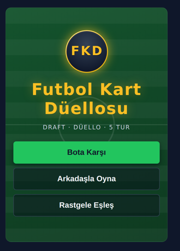
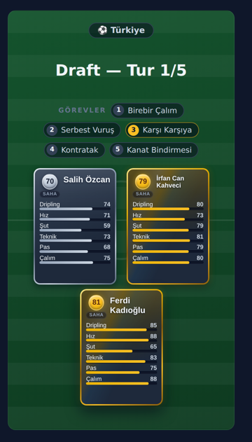
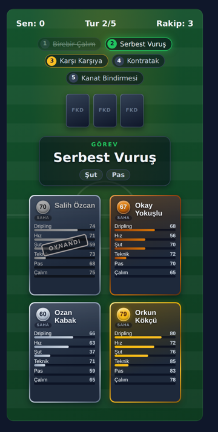
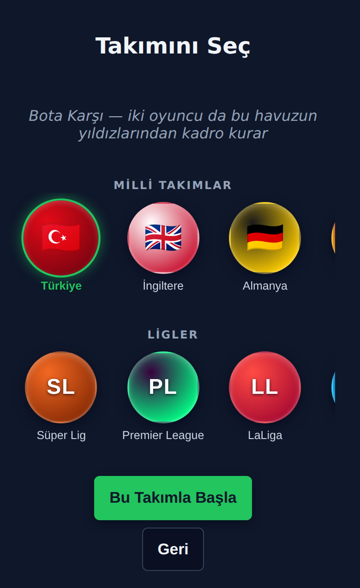
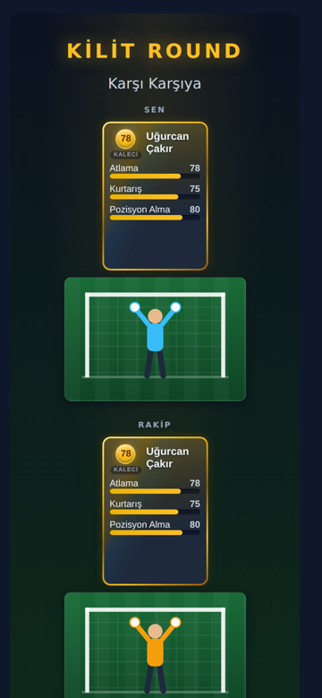
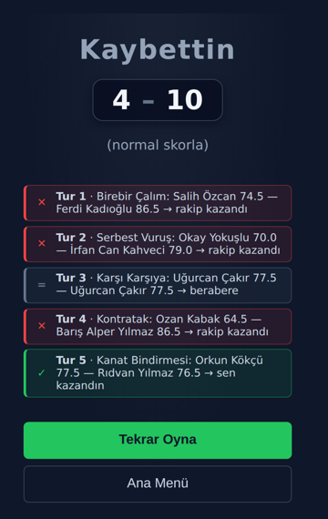
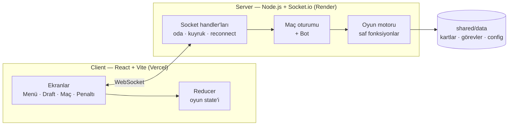

# ⚽ Futbol Kart Düellosu

**İki oyunculu, gerçek zamanlı futbol kart oyunu.** Futbolcu kartlarıyla kadronu draft'la kur, sonra 5 turluk görev bazlı bir düelloda rakibinle kafa kafaya gel.

[](https://futbol-kart-duellosu-server-virid.vercel.app)
[](https://github.com/merenkoc/futbol-kart-duellosu/actions/workflows/test.yml)


<p align="center">
  
  
  
</p>
<p align="center">
  
  
  
</p>

> 📱 Oyun mobil tarayıcıda sorunsuz çalışır. **Mobil uygulama sürümü geliştiriliyor.**

---

## 🎮 Nasıl Oynanır?

### 1. Takımını seç
9 milli takım (Türkiye, İngiltere, Almanya, İspanya, Fransa, İtalya, Portekiz, Arjantin, Brezilya) ve 6 lig (Süper Lig, Premier League, LaLiga, Serie A, Bundesliga, Ligue 1) arasından bir havuz seçersin. İki oyuncu da aynı havuzun yıldızlarından kadro kurar.

### 2. Draft: kadronu kur
- 5 draft turu var. Her turda önüne 3 kart gelir, birini seçersin.
- 3. tur kaleci turudur.
- Sonunda elinde **4 saha oyuncusu + 1 kaleci** olur.
- Adil olsun diye iki oyuncuya her turda aynı kademe dağılımı sunulur (örneğin alt + orta + üst).
- Maçta hangi görevlerin geleceği draft sırasında görünür, kadronu buna göre kurarsın.

### 3. Maç: 5 turluk düello
- Her turda bir **görev** açıklanır: Ara Pası, Kontratak, Uzaktan Şut, Birebir Çalım…
- İki oyuncu **kör seçimle**, yani rakibin kartını görmeden, aynı anda bir kart oynar.
- Kartlar açılır ve göreve uygun statlar karşılaştırılır. Örneğin *Serbest Vuruş* için şut ve pas bakılır.
- Turu kazanan **3 puan** alır. Beraberlikte iki oyuncu da **1'er puan** alır.
- Oynanan kart o maçta tekrar kullanılamaz.

### 4. Kilit Round
3. turda kaleciler otomatik olarak karşı karşıya gelir. Bu tur, kaleci görevleriyle (Karşı Karşıya, Aşırtmayı Tutma…) oynanan özel animasyonlu bir turdur.

### 5. Penaltılar
- Puanlar eşitse penaltıya gidilir.
- Her oyuncu kartlarından birini atıcı seçer. Atıcı gücü rakip kalecinin kurtarış gücünü geçerse gol olur.
- Eşitlik sürerse ani ölüme geçilir.
- Saha kartları biterse kaleciler birbirine penaltı atar.

---

## ✨ Özellikler

- **3 oyun modu:** Bota Karşı, Arkadaşla Oyna (oda linki ile) ve Rastgele Eşleş (matchmaking kuyruğu).
- **Gerçek zamanlı multiplayer:** Socket.io ile anlık eşleşme ve kör seçim.
- **Hile korumalı mimari:** tüm oyun mantığı sunucuda çalışır. Rakibin eli, seçenekleri ve kilitlenmemiş seçimleri client'a hiçbir zaman gönderilmez.
- **Yeniden bağlanma:** bağlantın koparsa 60 saniye içinde maça kaldığın yerden dönersin. Sayfayı yenilemek de maçı bozmaz.
- **Kural bazlı bot:** göreve göre en iyi kartı oynar. Zorluk ayarı `config.json`'dan yapılır.
- **15 takım/lig havuzu, 450 kart** (375 saha oyuncusu + 75 kaleci).
- **Veri odaklı tasarım:** görev formülleri JSON'da stat ağırlığı olarak tanımlı. Yeni görev ya da stat eklemek kod değişikliği gerektirmez.
- **Animasyonlar:** Framer Motion ile kart çevirme, Kilit Round sekansı ve penaltı sahnesi. "Hareketi azalt" tercihine uyar.
- **Dosyasız ses efektleri:** Web Audio API ile anlık üretilir.
- **Mobil uyumlu arayüz:** dokunmatik kontroller ve safe-area desteği.
- **110 otomatik test** (Vitest). Her push'ta GitHub Actions'ta çalışır.

---

## 🏗️ Mimari



npm workspaces ile kurulmuş bir monorepo:

| Paket | Görev |
|---|---|
| `shared/` | Ortak TypeScript tipleri ve oyun verisi (`cards.json`, `tasks.json`, `config.json`, `pools.json`) |
| `server/` | Oyun motoru (draft, maç, puanlama, penaltı), bot, oda/eşleşme sistemi ve Socket.io katmanı |
| `client/` | React arayüzü, ekranlar, animasyonlar ve ses |

**Tasarım kararları:**
- Oyun motoru **saf fonksiyonlardan** oluşur. Tüm rastgelelik seed'lenebilir bir RNG (`mulberry32`) ile enjekte edilir, bu yüzden testler deterministiktir.
- Maç state'i sunucu belleğinde tutulur. Hesap ya da veritabanı yoktur, maç bitince her şey sıfırlanır.

---

## 🛠️ Teknolojiler

| Alan | Teknoloji |
|---|---|
| Dil | TypeScript |
| Frontend | React 18, Vite, Framer Motion |
| Backend | Node.js, Socket.io |
| Test | Vitest |
| Deploy | Vercel (client), Render (server) |

---

## 🚀 Kendi Bilgisayarında Çalıştır

Gereksinim: **Node.js 20+**

```bash
git clone https://github.com/merenkoc/futbol-kart-duellosu.git
cd futbol-kart-duellosu
npm install        # tüm paketleri kökten kurar
npm run dev        # server (3001) + client (5173) birlikte başlar
```

Tarayıcıda **http://localhost:5173** adresini aç. Lokal geliştirmede `.env` dosyasına gerek yok, varsayılan adresler kullanılır.

### Testler

```bash
npm test                          # server + client testlerinin tamamı
npm run typecheck -w @fkd/server  # tip kontrolü
```

### Yayına alma

Vercel + Render kurulumu için [docs/DEPLOYMENT.md](docs/DEPLOYMENT.md) dosyasına bak.

---

## 📁 Proje Yapısı

```
.
├── client/
│   ├── src/
│   │   ├── screens/        # Menü, Takım Seçimi, Lobi, Draft, Maç, Kilit Round, Penaltı, Maç Sonu
│   │   ├── components/     # Kart, düello alanı, görev zaman çizelgesi
│   │   ├── reducer.ts      # Client oyun state'i
│   │   ├── socket.ts       # Socket.io bağlantısı
│   │   └── sound.ts        # Web Audio ses efektleri
│   └── tests/
├── server/
│   ├── src/
│   │   ├── engine/         # draft, match, scoring, penalty, rng (saf fonksiyonlar)
│   │   ├── game/           # Maç oturumu ve bot
│   │   ├── realtime/       # Oda, eşleşme kuyruğu, maç deposu
│   │   └── socket/         # Socket event handler'ları
│   └── tests/
├── shared/
│   ├── data/               # cards.json, tasks.json, config.json, pools.json
│   └── src/                # Ortak tipler
├── tools/
│   ├── gen-pools.mjs       # Oyuncu veri setinden kart havuzu üretici
│   └── kart-editoru.html   # Kart verisi düzenleme aracı
├── docs/
├── render.yaml             # Render blueprint (server)
└── vercel.json             # Vercel build ayarı (client)
```

---

## 🗺️ Yol Haritası

- [x] Oyun motoru ve birim testleri
- [x] Bota karşı oyun
- [x] Multiplayer: oda linki, eşleşme ve yeniden bağlanma
- [x] Animasyonlar, ses ve mobil uyumluluk
- [x] Canlıya alma (Vercel + Render)
- [x] Takım/lig seçim sistemi
- [ ] **Mobil uygulama** (geliştiriliyor)

---

## ℹ️ Notlar

- Sunucu Render'ın ücretsiz planında çalışıyor. 15 dakika kullanılmazsa uykuya geçer, ilk açılışta uyanması 30–60 saniye sürebilir. Açılış ekranı bu bekleme için tasarlandı.
- Oyuncu istatistikleri, herkese açık EA SPORTS FC oyuncu veri setinden türetilmiştir. Bu proje EA SPORTS, FIFA ya da herhangi bir kulüp veya ligle bağlantılı değildir. Kâr amacı gütmeyen, kişisel bir portfolyo projesidir.

---

Geliştirici: [@merenkoc](https://github.com/merenkoc)
